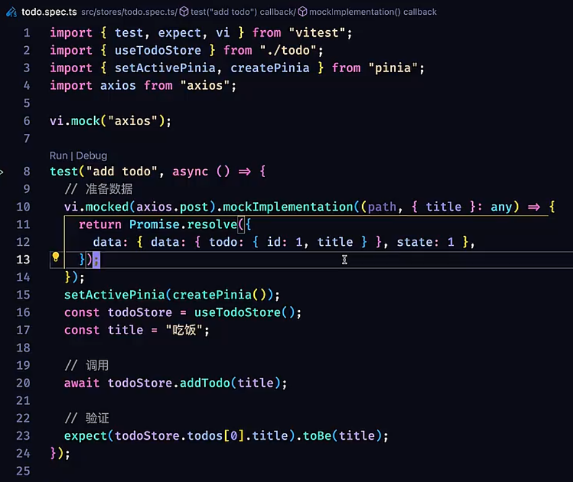
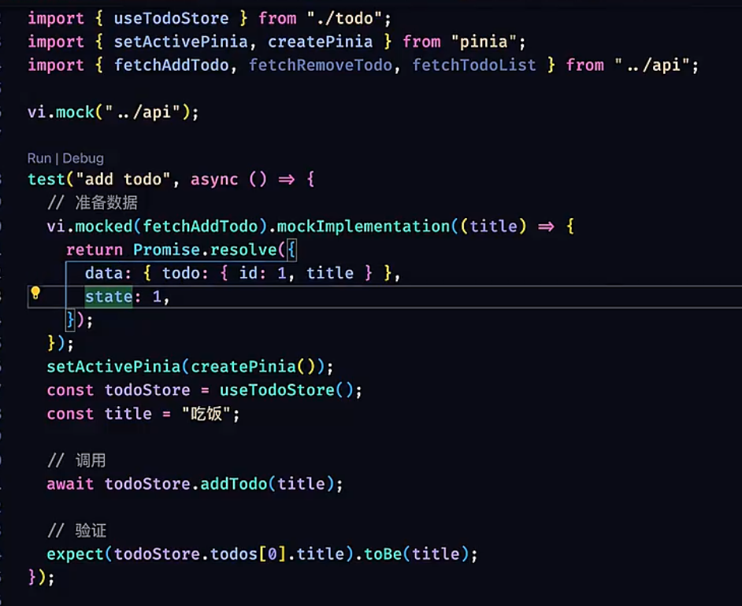
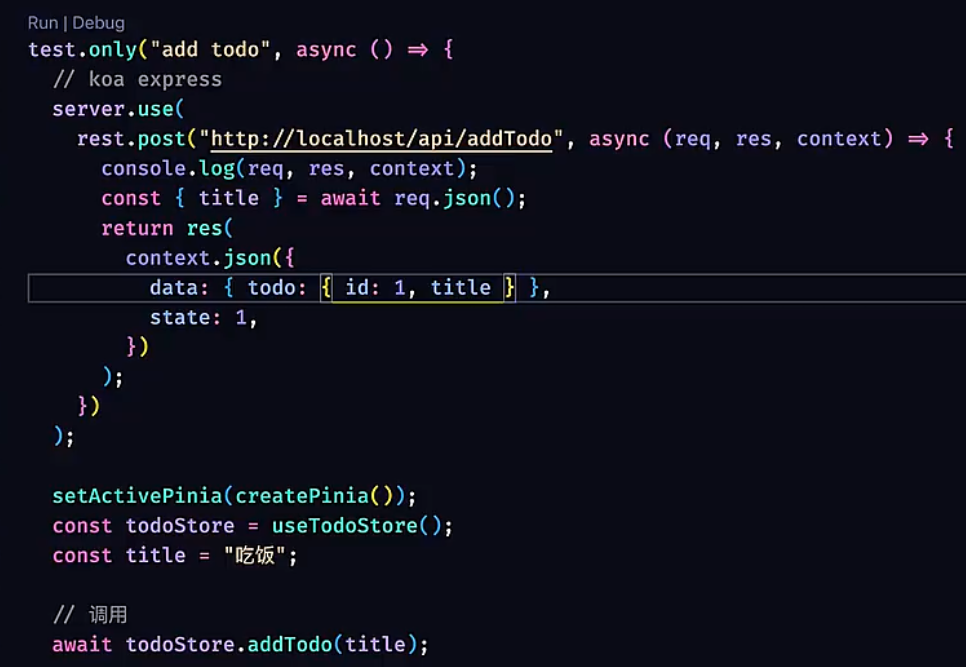

业务代码 ——> 中间层 api.ts ——> axios ——> server

# 1.直接 mock 
以axios为例
mockImplementation

注意视频中8:15将行为验证转化为状态验证的处理

缺点: 暴露实现细节, 控制输入输出比较麻烦
不太推荐
# 2.mock 中间层


推荐
1. 更容易控制输入和输出
2. 隐藏实现细节
3. 没有额外学习成本
# 3.使用 mock server worker
需要用到第三方库
`pnpm install msw -D`

在 src 中创建一个 mocks 文件夹, 然后在里面创建一个 server.ts 文件

```typescript
// mocks/server.ts
import { setupServer } from 'msw/node'

export const server = setupServer()
```

需要在测试代码中加入生命周期钩子
```typescript
// example.spec.ts
import { beforeAll, afterEach, afterAll } from 'vitest'
import { server } from '../mocks/server'

beforeAll(() => {
    server.listen()
})

afterEach(() => {
    server.resetHandlers()
})

afterAll(() => {
    server.close()
})
```



对于那些 server.use 中重复出现的 rest 可以抽离出来放到一个叫 handlers.ts 的文件中

使用 msw 会比较方便重构

可以通过配置来对多个测试文件共享的 setup 逻辑进行管理(setupFiles)